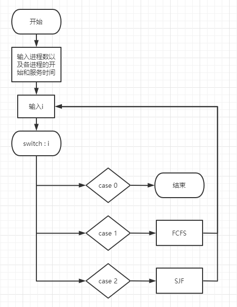
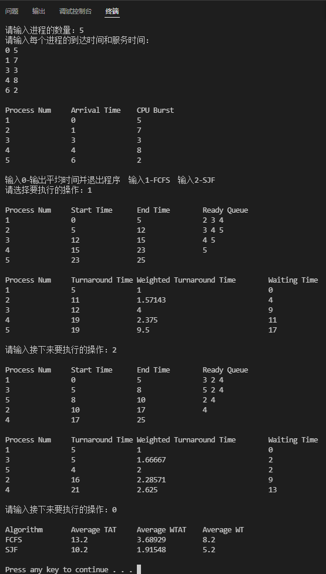

# 进程调度(FCFS和SJF)

## 问题描述

设计程序模拟进程的先来先服务FCFS和短作业优先SJF调度过程。假设有n个进程分别在T1, … ,Tn时刻到达系统，它们需要的服务时间分别为S1, … ,Sn。分别采用先来先服务FCFS和短作业优先SJF进程调度算法进行调度，计算每个进程的完成时间，周转时间、带权周转时间和等待时间，并且统计n个进程的平均周转时间、平均带权周转时间和平均等待时间。最后，对两个算法做出比较评价。

要求采用先来先服务FCFS和短作业优先SJF分别调度进程运行，计算每个进程的周转时间，带权周转时间和等待时间，并且计算所有进程的平均周转时间，带权平均周转时间和平均等待时间。

## 实验环境

- Windows 11
- Visual Studio Code
- gcc version 8.1.0

## 输入

进程数n，进程编号，以及每个进程的到达时间T1, … ,Tn和服务时间S1, … ,Sn。在屏幕上要以表的形式显示输入的信息。

根据显示信息：“1-FCFS，2-SJF”，选择1或者2进入对应的算法过程。

## 输出

- 要求模拟整个调度过程，输出每个时刻的进程运行状态
- 要求输出计算出来的每个进程的周转时间，带权周转时间和等待时间
- 要求输出所有进程的平均周转时间，带权平均周转时间和平均等待时间

## 测试数据

| **Process Num.** | **1** | **2** | **3** | **4** | **5** |
| ---------------- | ----- | ----- | ----- | ----- | ----- |
| **Arrival Time** | **0** | **1** | **3** | **4** | **6** |
| **CPU Burst**    | **5** | **7** | **3** | **8** | **2** |

## 实验设计

### 数据结构

```cpp
#define MaxNum 100                                // 最大进程数
double AverageWT_FCFS = 0, AverageWT_SJF = 0;     // 平均等待时间
double AverageTAT_FCFS = 0, AverageTAT_SJF = 0;   // 平均周转时间
double AverageWTAT_FCFS = 0, AverageWTAT_SJF = 0; // 平均带权周转时间
using namespace std;

// 进程结构体
typedef struct PROCESS
{
    int index;                    // 进程序号
    double ServiceTime;           // 服务时间
    double ArrivalTime;           // 到达时间
    double StartTime;             // 开始时间
    double FinishTime;            // 结束时间
    double TurnArroundTime;       // 周转时间
    double WaitTime;              // 等待时间
    double WeightTurnArroundTime; // 带权周转时间
} PRO[MaxNum];
```

### 函数的功能、参数和输出

```cpp
// 输出各进程的到达时间和服务时间
void display_base(PRO PC, int n)

// 输出每个时刻的进程运行状态
void display_status(PRO PC, int n)

// 输出各进程的周转时间、带权周转时间和等待时间
void display_time(PRO PC, int n)

// 输出所有进程的的平均周转时间、带权平均周转时间和平均等待时间
void display_average()
    
// 按到达时间排序
void SortArrival(PRO &PC, int n)

// 计算各项时间 z为记号变量 用于区别FCFS和SJF
void CountTime(PRO &PC, int n, int z)

// FCFS算法
void FCFS(PRO &PC, int n)

// SJF算法
void SJF(PRO &PC, int n)

// 关于以上函数的参数，PC均为进程的结构体数组，n均为进程的数量
```

### 主要函数算法设计

```cpp
// 模拟整个调度过程，输出每个时刻的进程运行状态
void display_status(PRO PC, int n)
{
    cout << endl;
    cout << "Process Num\t"
         << "Start Time\t"
         << "End Time\t"
         << "Ready Queue" << endl;
    for (int t = 0; t < n; t++) // 循环输出每个进程的服务时间内 处在等待队列的进程 即到达时间在当前进程开始和结束时间之间的进程
    {
        cout << PC[t].index << "\t\t" << PC[t].StartTime << "\t\t" << PC[t].FinishTime << "\t\t";
        for (int q = t + 1; q < n; q++)
        {
            if (PC[q].ArrivalTime <= PC[t].FinishTime)
                cout << PC[q].index << " ";
        }
        cout << endl;
    }
}
```

```cpp
// 按到达时间排序
void SortArrival(PRO &PC, int n)
{
    PROCESS temp;
    for (int i = 0; i < n; i++)
    {
        int min = i;
        for (int j = i + 1; j < n; j++)
            if (PC[j].ArrivalTime < PC[min].ArrivalTime)
                min = j;
        temp = PC[i];
        PC[i] = PC[min];
        PC[min] = temp;
    }
}
```

```cpp
// 计算各项时间 z为记号变量 用于区别FCFS和SJF
void CountTime(PRO &PC, int n, int z)
{
    PC[0].StartTime = PC[0].ArrivalTime;
    PC[0].FinishTime = PC[0].ArrivalTime + PC[0].ServiceTime;
    PC[0].TurnArroundTime = PC[0].FinishTime - PC[0].ArrivalTime;
    PC[0].WaitTime = 0;
    PC[0].WeightTurnArroundTime = PC[0].TurnArroundTime / PC[0].ServiceTime;
    double sumWT = PC[0].WaitTime, sumTAT = PC[0].TurnArroundTime, sumWTAT = PC[0].WeightTurnArroundTime;
    for (int m = 1; m < n; m++)
    {
        if (PC[m].ArrivalTime >= PC[m - 1].FinishTime)
        {
            PC[m].StartTime = PC[m].ArrivalTime;
            PC[m].WaitTime = 0;
        }
        else
        {
            PC[m].StartTime = PC[m - 1].FinishTime;
            PC[m].WaitTime = PC[m - 1].FinishTime - PC[m].ArrivalTime;
        }
        PC[m].FinishTime = PC[m].StartTime + PC[m].ServiceTime;
        PC[m].TurnArroundTime = PC[m].FinishTime - PC[m].ArrivalTime;
        PC[m].WeightTurnArroundTime = PC[m].TurnArroundTime / PC[m].ServiceTime;
        sumWT += PC[m].WaitTime;
        sumTAT += PC[m].TurnArroundTime;
        sumWTAT += PC[m].WeightTurnArroundTime;
    }
    if(z == 1) // 计算FCFS
    {
        AverageWT_FCFS = sumWT / n;
        AverageTAT_FCFS = sumTAT / n;
        AverageWTAT_FCFS = sumWTAT / n;
    }
    if(z == 2) // 计算SJF
    {
        AverageWT_SJF = sumWT / n;
        AverageTAT_SJF = sumTAT / n;
        AverageWTAT_SJF = sumWTAT / n;
    }
}
```

```cpp
// FCFS算法
void FCFS(PRO &PC, int n)
{

    SortArrival(PC, n);    // 按到达时间进行排序
    CountTime(PC, n, 1);   // 计算各项时间
    display_status(PC, n); // 模拟整个调度过程，输出每个时刻的进程运行状态
    display_time(PC, n);   // 输出各进程的周转时间、带权周转时间和等待时间
}
```

```cpp
// SJF算法
void SJF(PRO &PC, int n)
{
    SortArrival(PC, n); // 先按到达时间进行排序
    // 类比选择排序的思想 从第二个到达的进程开始 遍历当前进程后面的进程 如果有服务时间比当前最短服务时间更短的 则交换位置
    int End = PC[0].ArrivalTime + PC[0].ServiceTime; // 之前服务的结束时间
    int tmin = 1;                                    // 当前最短服务时间的索引
    PROCESS temp;
    for (int x = 1; x < n; x++)
    {
        for (int y = x + 1; y < n; y++)
        {
            if (PC[y].ArrivalTime <= End && PC[y].ServiceTime < PC[tmin].ServiceTime)
                tmin = y;
        }
        // 将当前进程与等待队列中服务时间最短的进程进行交换
        temp = PC[x];
        PC[x] = PC[tmin];
        PC[tmin] = temp;
        End += PC[x].ServiceTime;
    }
    CountTime(PC, n, 2);   // 计算各项时间
    display_status(PC, n); // 模拟整个调度过程，输出每个时刻的进程运行状态
    display_time(PC, n);   // 输出各进程的周转时间、带权周转时间和等待时间
}
```

### 详细设计

- 变量初始化

- 接收用户输入n，T1, … ,Tn，S1, … ,Sn

- 循环等待用户选择算法：1-FCFS，2-SJF

- 按照选择算法进行进程调度

- 计算进程的开始时间、完成时间、周转时间、带权周转时间和等待时间

- 计算所有进程的平均周转时间、平均带权周转时间和平均等待时间

- 按格式输出调度结果

### 流程图



## 实验结果与分析

### 结果展示与描述



- 输入进程数量和各进程的基本信息：到达时间和服务时间
- 选择算法    注：在选择0之前需要将1和2都选择过
- 选择1  按FCFS算法输出各进程的执行顺序、开始和完成时间、等待队列、周转时间、带权周转时间和等待时间
- 选择2  按SJF算法输出各进程的执行顺序、开始和完成时间、等待队列、周转时间、带权周转时间和等待时间
- 选择0  输出本实验数据使用两种算法得到的不同平均周转时间、平均带权周转时间和平均等待时间
- 实验结束

### 结果分析

- FCFS算法通过按到达时间排序的方式得到服务顺序，计算时还需要考虑当前进程结束时下一个进程是否已经到达，进行条件判断后代入不同结果计算，最终验证与手动计算结果相同
- SJF算法先按到达时间排序，再将每个进程服务时间段内的等待队列按服务时间由短至长排序，从而得到服务顺序，之后的计算方式与FCFS相同，最终验证与手动计算结果相同

### 总结

- 本次实验将所有需要重复使用的代码都打包成函数，在主函数中直接进行调用，使代码简洁、清晰。

- 在数据结构方面，因为对队列的使用还不是很熟悉，所以我在实现算法的过程中，使用了结构体数组，考虑到计算过程会出现整数与小数的混合运算，我将除进程序号外的所有数据都设为double型，便不会在结果中出现小数部分被舍弃的问题。

- 对于SJF算法的排序，我直接对等待队列进行排序，避免使用复杂的算法，使用变量End判定进程是否处在等待队列，将所有进程都排好序之后直接调用CountTime函数进行计算，不仅使算法更简单，还体现出了FCFS和SJF两种算法的区别，便于学习和理解。
- 在主函数中，使用while循环，重复选择算法，若选择0则输出所有进程的平均周转时间，带权平均周转时间和平均等待时间并且退出循环，以实现循环选择算法的功能。

## 源代码

```cpp
#include <iostream>

#define MaxNum 100                                // 最大进程数
double AverageWT_FCFS = 0, AverageWT_SJF = 0;     // 平均等待时间
double AverageTAT_FCFS = 0, AverageTAT_SJF = 0;   // 平均周转时间
double AverageWTAT_FCFS = 0, AverageWTAT_SJF = 0; // 平均带权周转时间
using namespace std;

// 进程结构体
typedef struct PROCESS
{
    int index;                    // 进程序号
    double ServiceTime;           // 服务时间
    double ArrivalTime;           // 到达时间
    double StartTime;             // 开始时间
    double FinishTime;            // 结束时间
    double TurnArroundTime;       // 周转时间
    double WaitTime;              // 等待时间
    double WeightTurnArroundTime; // 带权周转时间
} PRO[MaxNum];

// 输出各进程的到达时间和服务时间
void display_base(PRO PC, int n)
{
    cout << endl;
    cout << "Process Num\t"
         << "Arrival Time\t"
         << "CPU Burst" << endl;
    for (int t = 0; t < n; t++)
        cout << PC[t].index << "\t\t" << PC[t].ArrivalTime << "\t\t" << PC[t].ServiceTime << endl;
}

// 模拟整个调度过程，输出每个时刻的进程运行状态
void display_status(PRO PC, int n)
{
    cout << endl;
    cout << "Process Num\t"
         << "Start Time\t"
         << "End Time\t"
         << "Ready Queue" << endl;
    for (int t = 0; t < n; t++) // 循环输出每个进程的服务时间内 处在等待队列的进程 即到达时间在当前进程开始和结束时间之间的进程
    {
        cout << PC[t].index << "\t\t" << PC[t].StartTime << "\t\t" << PC[t].FinishTime << "\t\t";
        for (int q = t + 1; q < n; q++)
        {
            if (PC[q].ArrivalTime <= PC[t].FinishTime)
                cout << PC[q].index << " ";
        }
        cout << endl;
    }
}

// 输出各进程的周转时间、带权周转时间和等待时间
void display_time(PRO PC, int n)
{
    cout << endl;
    cout << "Process Num\t"
         << "Turnaround Time\t"
         << "Weighted Turnaround Time\t"
         << "Waiting Time" << endl;
    for (int t = 0; t < n; t++)
        cout << PC[t].index << "\t\t" << PC[t].TurnArroundTime << "\t\t" << PC[t].WeightTurnArroundTime << "\t\t\t\t" << PC[t].WaitTime << endl;
}

// 输出所有进程的的平均周转时间、带权平均周转时间和平均等待时间
void display_average()
{
    cout << endl;
    cout << "Algorithm\t"
         << "Average TAT\t"
         << "Average WTAT\t"
         << "Average WT" << endl;
    cout << "FCFS\t\t" << AverageTAT_FCFS << "\t\t" << AverageWTAT_FCFS << "\t\t" << AverageWT_FCFS << endl;
    cout << "SJF\t\t" << AverageTAT_SJF << "\t\t" << AverageWTAT_SJF << "\t\t" << AverageWT_SJF << endl;
}

// 按到达时间排序
void SortArrival(PRO &PC, int n)
{
    PROCESS temp;
    for (int i = 0; i < n; i++)
    {
        int min = i;
        for (int j = i + 1; j < n; j++)
            if (PC[j].ArrivalTime < PC[min].ArrivalTime)
                min = j;
        temp = PC[i];
        PC[i] = PC[min];
        PC[min] = temp;
    }
}

// 计算各项时间 z为记号变量 用于区别FCFS和SJF
void CountTime(PRO &PC, int n, int z)
{
    PC[0].StartTime = PC[0].ArrivalTime;
    PC[0].FinishTime = PC[0].ArrivalTime + PC[0].ServiceTime;
    PC[0].TurnArroundTime = PC[0].FinishTime - PC[0].ArrivalTime;
    PC[0].WaitTime = 0;
    PC[0].WeightTurnArroundTime = PC[0].TurnArroundTime / PC[0].ServiceTime;
    double sumWT = PC[0].WaitTime, sumTAT = PC[0].TurnArroundTime, sumWTAT = PC[0].WeightTurnArroundTime;
    for (int m = 1; m < n; m++)
    {
        if (PC[m].ArrivalTime >= PC[m - 1].FinishTime)
        {
            PC[m].StartTime = PC[m].ArrivalTime;
            PC[m].WaitTime = 0;
        }
        else
        {
            PC[m].StartTime = PC[m - 1].FinishTime;
            PC[m].WaitTime = PC[m - 1].FinishTime - PC[m].ArrivalTime;
        }
        PC[m].FinishTime = PC[m].StartTime + PC[m].ServiceTime;
        PC[m].TurnArroundTime = PC[m].FinishTime - PC[m].ArrivalTime;
        PC[m].WeightTurnArroundTime = PC[m].TurnArroundTime / PC[m].ServiceTime;
        sumWT += PC[m].WaitTime;
        sumTAT += PC[m].TurnArroundTime;
        sumWTAT += PC[m].WeightTurnArroundTime;
    }
    if (z == 1) // 计算FCFS
    {
        AverageWT_FCFS = sumWT / n;
        AverageTAT_FCFS = sumTAT / n;
        AverageWTAT_FCFS = sumWTAT / n;
    }
    if (z == 2) // 计算SJF
    {
        AverageWT_SJF = sumWT / n;
        AverageTAT_SJF = sumTAT / n;
        AverageWTAT_SJF = sumWTAT / n;
    }
}

// FCFS算法
void FCFS(PRO &PC, int n)
{

    SortArrival(PC, n);    // 按到达时间进行排序
    CountTime(PC, n, 1);   // 计算各项时间
    display_status(PC, n); // 模拟整个调度过程，输出每个时刻的进程运行状态
    display_time(PC, n);   // 输出各进程的周转时间、带权周转时间和等待时间
}

// SJF算法
void SJF(PRO &PC, int n)
{
    SortArrival(PC, n); // 先按到达时间进行排序
    // 类比选择排序的思想 从第二个到达的进程开始 遍历当前进程后面的进程 如果有服务时间比当前最短服务时间更短的 则交换位置
    int End = PC[0].ArrivalTime + PC[0].ServiceTime; // 之前服务的结束时间
    int tmin = 1;                                    // 当前最短服务时间的索引
    PROCESS temp;
    for (int x = 1; x < n; x++)
    {
        for (int y = x + 1; y < n; y++)
        {
            if (PC[y].ArrivalTime <= End && PC[y].ServiceTime < PC[tmin].ServiceTime)
                tmin = y;
        }
        // 将当前进程与等待队列中服务时间最短的进程进行交换
        temp = PC[x];
        PC[x] = PC[tmin];
        PC[tmin] = temp;
        End += PC[x].ServiceTime;
    }
    CountTime(PC, n, 2);   // 计算各项时间
    display_status(PC, n); // 模拟整个调度过程，输出每个时刻的进程运行状态
    display_time(PC, n);   // 输出各进程的周转时间、带权周转时间和等待时间
}

int main()
{
    PRO pc;
    int n;
    cout << "请输入进程的数量：";
    cin >> n;
    cout << "请输入每个进程的到达时间和服务时间：" << endl;
    for (int i = 0; i < n; i++)
    {
        pc[i].index = i + 1;
        cin >> pc[i].ArrivalTime >> pc[i].ServiceTime;
    }
    display_base(pc, n);
    int choice;
    cout << endl
         << "输入0-输出平均时间并退出程序  输入1-FCFS  输入2-SJF" << endl
         << "请选择要执行的操作：";
    cin >> choice;
    while (choice != 0)
    {
        if (choice == 1)
            FCFS(pc, n);
        if (choice == 2)
            SJF(pc, n);
        cout << endl
             << "请输入接下来要执行的操作：";
        cin >> choice;
    }
    display_average();
    cout << endl;
    system("pause");
    return 0;
}
```


